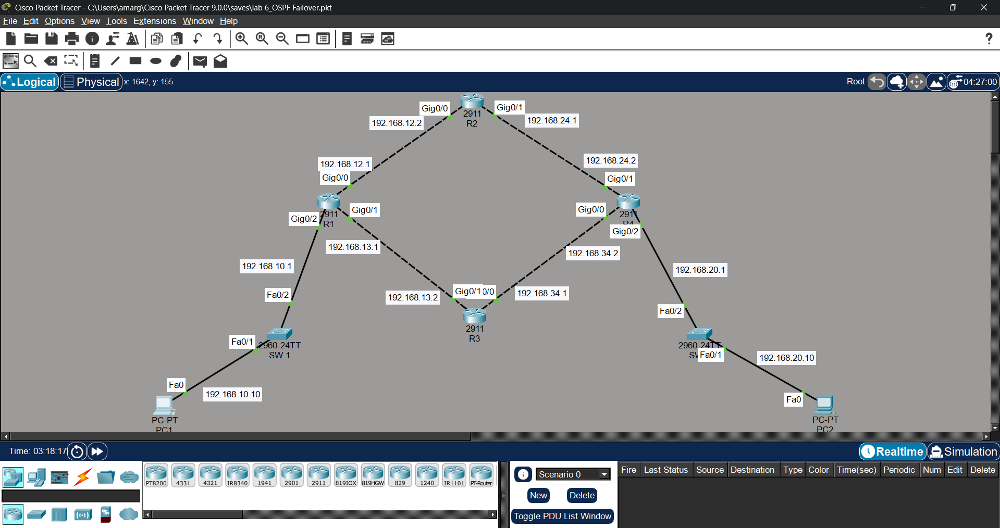
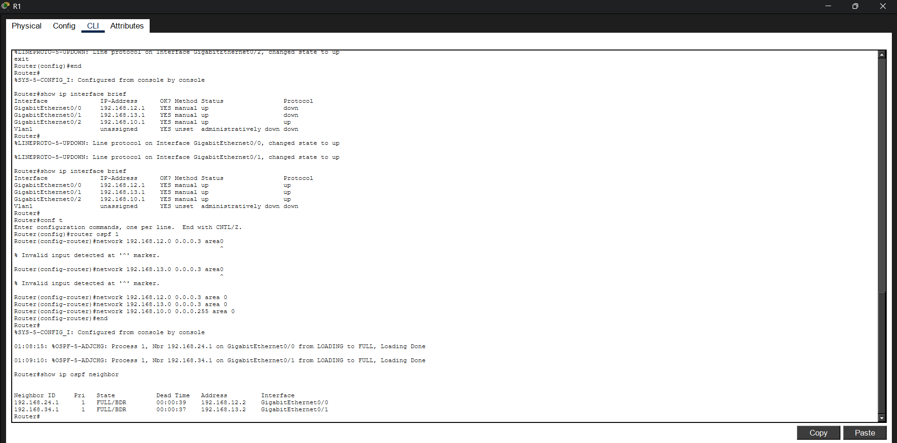
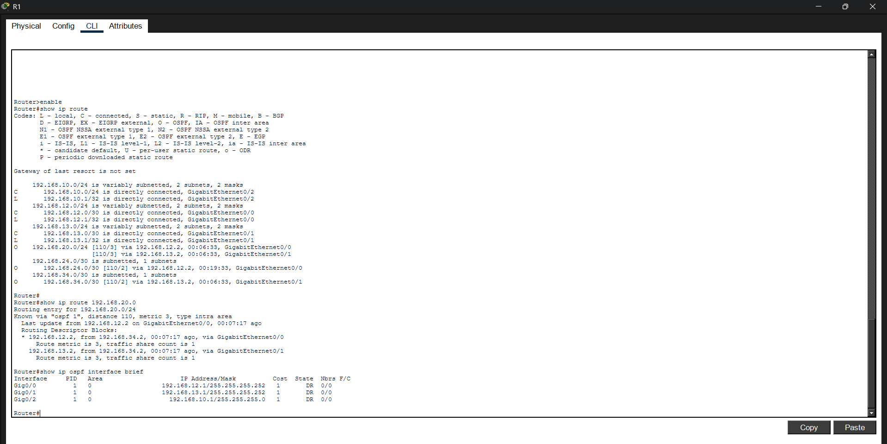
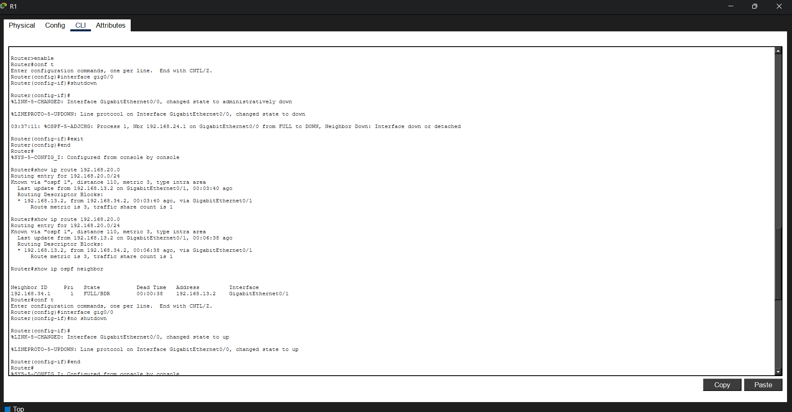
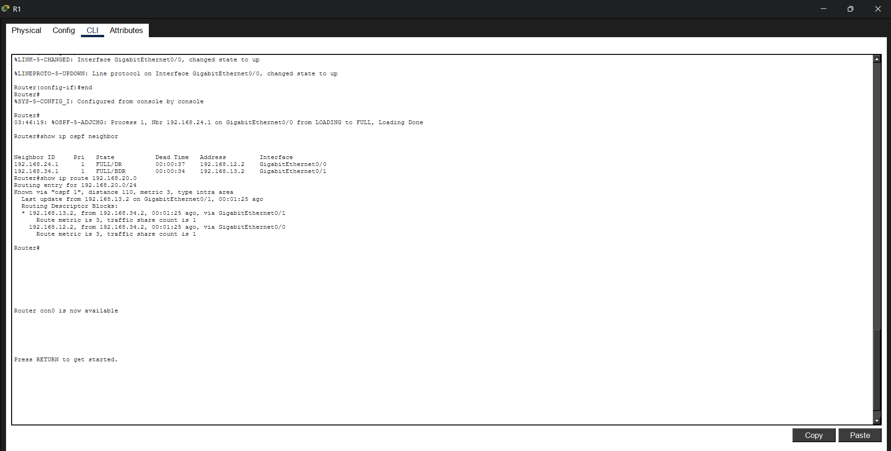
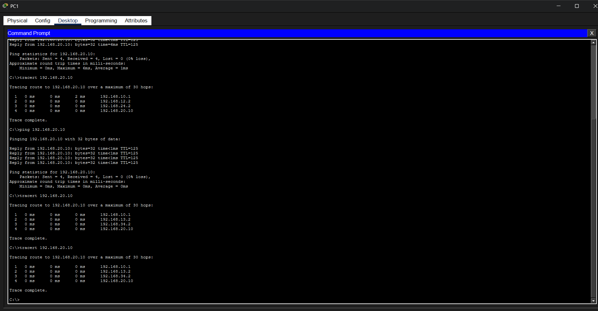

# OSPF Failover & Redundant Enterprise Network

## Overview

This project demonstrates the design and implementation of a redundant enterprise network using Cisco Packet Tracer and OSPF (Open Shortest Path First).

The network uses multiple routing paths between routers to provide redundancy. OSPF is configured to dynamically learn routes and select an alternate path when the primary routing link fails.

The project includes OSPF configuration, neighbor verification, routing table verification, link failure simulation, OSPF failover, link recovery, and end-to-end connectivity testing.

---

## 📸 Project Screenshots

### 1. Network Topology



---

### 2. OSPF Neighbor Relationship



---

### 3. Routing Table Before Failure



---

### 4. Link Failure Simulation



---

### 5. OSPF Failover Routing



---

### 6. End-to-End Connectivity Testing



---

## Network Topology

- 4 Cisco 2911 Routers
- 2 Cisco 2960-24TT Switches
- 2 PCs
- Multiple IPv4 Networks
- Redundant Routing Paths
- OSPF Area 0
- Point-to-Point /30 Networks
- LAN /24 Networks

---

## Technologies Used

- Cisco Packet Tracer
- OSPF (Open Shortest Path First)
- IPv4 Addressing
- Subnetting
- Wildcard Masks
- Dynamic Routing
- Cisco IOS
- Routing & Switching

---

## Features

- Redundant enterprise network topology
- IPv4 addressing configuration
- OSPF Area 0 implementation
- OSPF neighbor establishment
- Dynamic route learning
- Redundant routing paths
- Primary link failure simulation
- Automatic OSPF failover
- Alternate path selection
- Routing table verification
- End-to-end connectivity testing
- Link recovery
- Cisco IOS configuration

---

## Verification Commands

```bash
show ip interface brief
show ip ospf neighbor
show ip route
show ip protocols
show ip ospf interface brief
show running-config

---

## Failover Testing

The primary routing path was intentionally interrupted to simulate a network link failure.

After the failure, OSPF detected the topology change and recalculated the available routes. Traffic was automatically redirected through the alternate routing path.

The network was then restored and OSPF neighbor relationships were verified again.

This demonstrates how dynamic routing and redundant paths can maintain network connectivity during link failures.

---

## Project Outcome

Successfully designed and configured a redundant enterprise network using OSPF dynamic routing.

The project demonstrated OSPF neighbor establishment, dynamic route learning, routing redundancy, primary link failure simulation, automatic failover, alternate path selection, and end-to-end connectivity verification.

Network behavior was verified using OSPF neighbor states, routing tables, ping, and traceroute.

---

## Learning Outcomes

- Enterprise Network Design
- IPv4 Addressing
- Subnetting and Wildcard Masks
- OSPF Configuration
- OSPF Neighbor Adjacency
- Dynamic Routing
- Routing Redundancy
- Network Failover
- Cisco IOS CLI
- Routing Table Verification
- Network Troubleshooting
- Ping and Traceroute Analysis
- CCNA Practical Skills
